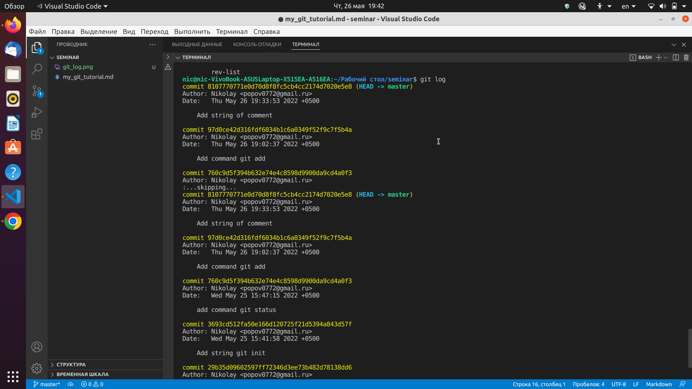

# This is my first Git tutorial

>Чтобы вы понимали важность знания гита в наше время, скажу так: без знания/понимания этого вам делать в программировании нечего. Но прелесть в том, что для постоянной работы не нужно держать в голове все команды и возможности. Нужно знать набор команд, которые помогут понимать всё, что происходит.

Чтобы создать локальный репозиторий нужно в терминале написать *git init*

Для просмотра статуса работы на данный момент использовать команду **git status**

Файлы могут иметь статус *отслеживаемых (staged)* и *не отслеживаемых (Untracked)* Для изменения статуса файла из неотслежываемого в отслеживаемый (сохранения изменений файла) используют команду **git add**. 
* Для изменения статуса одного кокретного файла  команда дается в виде **git add имя .расширение**.
* Для изменения статуса нескольких файлов имеюших одно расширение используют команду **git add имя.    расширение**.
* Для изменения статуса всех файлов- **git add -A**.

Для написания коментария к сохраненным изменениям в файле используют команду **git commit -m "..............   "** , где вместо точек пишется любой коментарий об изменениях в файле.

Для просмотра сохраненных изменений и коментариев используется команда **git log**
При запуске этой комады выводится следующее:

Переключиться между сохраненными изменениями можно с помошью команды: **git checkout ......** где вместо точек имя коментария (97d0ce42d316fdf6034b1c6a0349f52f9c7f5b4a)

Инфориация по работе с **Git** и **Markdown** взята с сатов:

1. [Ссылка для подсказок по Git](https://git-scm.com/book/ru/v2/%D0%92%D0%B2%D0%B5%D0%B4%D0%B5%D0%BD%D0%B8%D0%B5-%D0%9E-%D1%81%D0%B8%D1%81%D1%82%D0%B5%D0%BC%D0%B5-%D0%BA%D0%BE%D0%BD%D1%82%D1%80%D0%BE%D0%BB%D1%8F-%D0%B2%D0%B5%D1%80%D1%81%D0%B8%D0%B9)
2. [Ссылка для подсказок по Markdown](https://guides.hexlet.io/ru/markdown/)

# Семинар 2

* Создание новой ветки и переходы между ветками.

1. Для создания новой ветки используется команда *git branch branch_name* где *branch_name* имя ветки.
2. Для перехода между ветками используется команда *git checkout branch_name* где *branch_name* название целевой ветки.

* Слияние веток.пше

1. Для слияния веток используется команда *git merge branch_name*, где *branch_name* название ветки, сливаетмой с текущей веткой.

* Конфликты при слиянии и их разрешение.

1. Конфликты при слиянии возникают при наличии противоречащих коммитах в сливаемых ветках.

* Итоги семинара

## Второе задание к контролю версий.

**Задание 1 выполнено**

1. Создать мининмум 4 ветки

Начнем создавать ветки, назовем их Branch_1, Branch_2, Branch_3,Branch_4, Branch_5. Ветки названы одинаково специально, для быстроты вызова стрелкой и меняем последнюю цифру. Начинаем работать по веткам. Это останется в ветке Branch_1. Креативщик из меня еще тот, будем в тексте провто писать на какой ветке находимся.

Это останется в ветке Branch_2. 
Это останется в ветке Branch_3. 
Это останется в ветке Branch_4.
Это останется в ветке Branch_5.

2. Слить минимум 4 ветки

Слили ветки master and Branch_1- окно конфликта не открылось, пришлось оставить как есть. Будем пытаться объединять аккуратнее. 

master and Branch_2 слились прогнозируемо.
master and Branch_3 слились прогнозируемо.
master and Branch_4 слились прогнозируемо.
master and Branch_5 слились прогнозируемо.

* Сделать так, что бы при слиянии появился конфликт

Конфликт возник при первом слиянии, но программа не дала возможности выбрать разрешение конфликта.

При втором слиянии конфликт возник.

При третьем слиянии конфликт возник.

При четвертом слиянии конфликт возник.

При пятом слиянии конфликт возник.

* Разрешить конфликт

Конфликт 2 разрешен стандартно(приняты оба измения)

Конфликт 3 разрешен стандартно(приняты оба измения)

Конфликт 4 разрешен стандартно(приняты оба измения)

Конфликт 5 разрешен стандартно(приняты оба измения)

_*Домашнее задание выполнено*_

## Работа с удаленными репозитариями в git

*git clone URL* эта команда позволяет скопировать внешний репозитарий на ПК, где URL- адрес репозитория, который копируем на свой ПК.

*git pull* эта команда позволяет скачать все из текущего репозитория и автоматически
сделать merge с нашей версией

